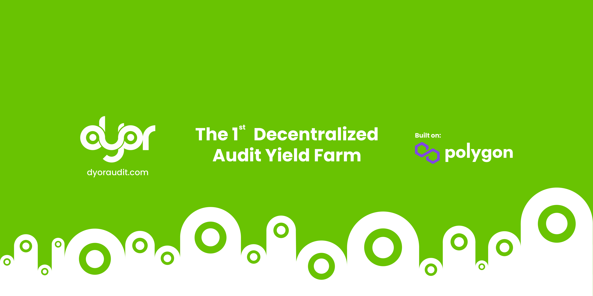

# 📖 Introducing DYOR Audit

\*\*\*\*[**DYOR Audit**](https://dyoraudit.com) **is the first ever truly Decentralized Audit Yield Farm seeking to incentivize community accountability and transparency in the cryptocurrency markets with the $DYOR Token at the heart of our system. The audit farm is deployed on Polygon \(formerly Matic Network\).  
  
After getting our hands burnt by rug pulls in the past, we realize the need to organize and channelize the effort of the community towards self accountability of the markets with \#DYOR as the incentive. Waiting around for slow moving, crony capitalist regulations to protect investors is only going to backfire in the future.**  
  
[**DYOR Audit**](https://dyoraudit.com) **provides industry grade security audits at a cost effective rate for projects. It will be handled by our team initially and is the necessary stepping stone to a decentralized audit system.  
  
We have decided to start off with a farm to incentivize our liquidity trading pairs in the market as well as pools because we find them to be one of the most proven and efficient ways to whip up quick organic community support for our vision.  
  
Doing it in this way prioritizes the earliest farmer - the early investor with the most belief in our vision to gain from what we’re doing over the ICO structure which prioritizes VCs and the influencers first. It also allows us the time to release the platform features in a way that is in tandem with community sentiment.  
  
We will explain more of what we have in mind in our roadmap!**

